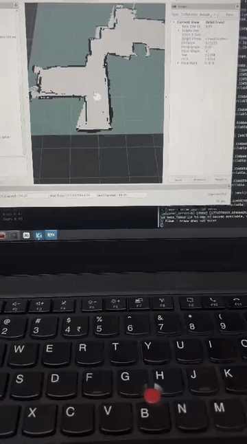

# 🤖 Anibot (ROS2 Navigation Robot)

> ⚠️ **This is an ongoing project (BETA). Active development in progress.**

Anibot is a **ROS2-based differential drive robot** built on a **Raspberry Pi 5**, designed for autonomous navigation using **Nav2** and **SLAM**.
The system supports teleoperation, mapping, localization, and autonomous path planning.

---

## 🚀 Overview

This project implements a complete mobile robotics stack using ROS2 Jazzy, including:

* Autonomous navigation with Nav2
* Real-time SLAM mapping
* Manual teleoperation control
* Docker-based deployment for portability

---

## 🎥 Progress Video



[▶ Watch Full Video](./assets/anibot_demo.mp4)

*(small bots are real headache ngl lmaoo ! jk)*

---

## 🧠 System Architecture

* **Platform:** Differential Drive Robot
* **Compute:** Raspberry Pi 5
* **Middleware:** ROS2 Jazzy
* **Navigation Stack:** Nav2
* **Mapping:** SLAM Toolbox
* **Sensor:** RPLidar
* **Control:** Keyboard Teleop

---

## 📦 Workspace Structure

```bash
anibot_ws/
├── src/            # ROS2 packages
├── assets/         # Demo videos, images
├── build/          # Build artifacts (ignored)
├── install/        # Install space (ignored)
├── log/            # Logs (ignored)
├── README.md
```

---

## ⚙️ Setup & Usage

### 🐳 Docker SSH

Run on laptop:

```bash
./docker_jazzy.sh
```

---

### 🎮 Teleoperation

```bash
ros2 run teleop_twist_keyboard teleop_twist_keyboard \
  --ros-args -p speed:=0.21 -p turn:=0.43
```

---

### 🧭 Navigation (Nav2)

```bash
ros2 launch interface anibot_full.launch.py map:=$HOME/maps/my_map.yaml
```

---

### 🗺️ SLAM Mapping

```bash
ros2 launch interface slam_full.launch.py
```

---

### 💾 Map Saving

```bash
ros2 run nav2_map_server map_saver_cli -f ~/maps/kitch \
  --ros-args -p save_map_timeout:=10.0
```

---

## ✨ Features

* ✅ Autonomous navigation (Nav2)
* ✅ SLAM-based mapping
* ✅ Teleoperation control
* ✅ Map saving & reuse
* ✅ Docker-based workflow
* 🚧 Continuous development (new features coming)

---

## 🔧 Hardware

* Raspberry Pi 5
* Differential drive base
* RPLidar
* Motor drivers (custom integration)

---

## 📌 Current Status

* Navigation stack working ✅
* SLAM integration working ✅
* Teleop control stable ✅
* System optimization ongoing 🚧

---

## 🧪 Future Work

* Sensor fusion (IMU + odometry)
* Improved localization accuracy
* UI/dashboard for monitoring
* Autonomous docking
* Remote operation interface

---

## ⚠️ Notes

* This is a **development-stage project**
* Code structure and features may change
* Not production-ready yet

---

## 🤝 Contributing

Currently not open for contributions. Will be enabled once project stabilizes.

---

## 📬 Contact

For queries or collaboration:

* Open an issue
* Or reach out directly

---

## ⭐ Acknowledgements

* ROS2 Community
* Nav2 Developers
* Open-source robotics ecosystem

---
